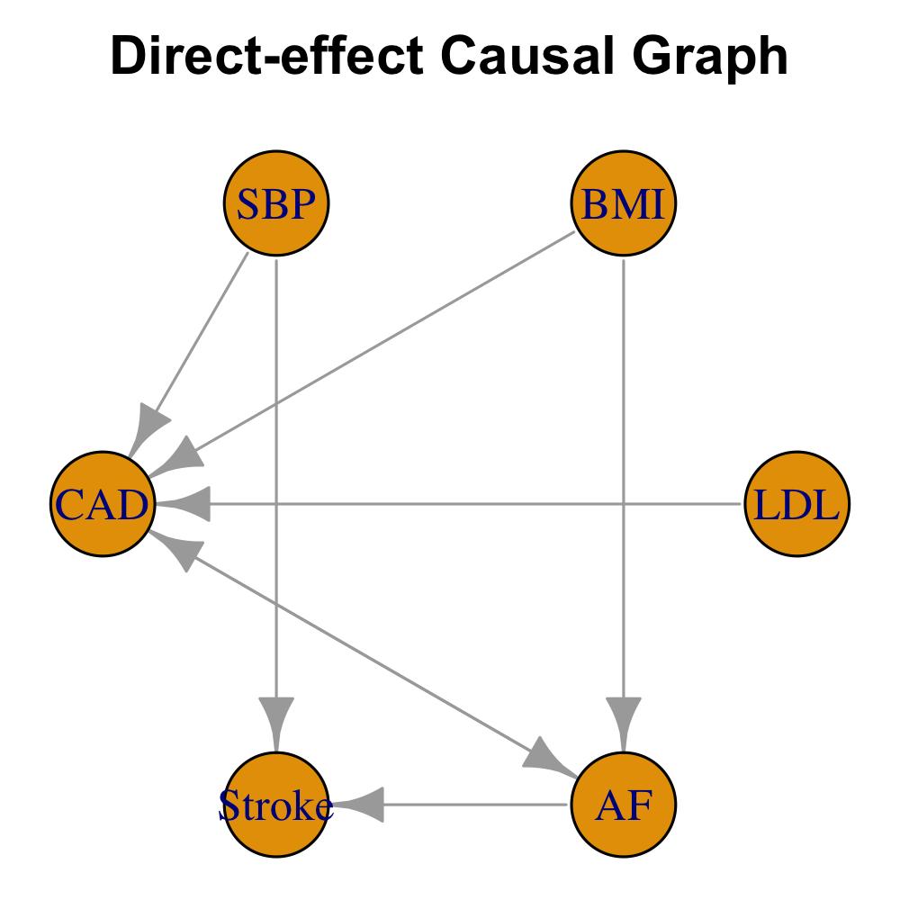

<!-- README.md is generated from README.Rmd. Please edit that file -->

```{r, include = FALSE}
knitr::opts_chunk$set(
  collapse = TRUE,
  comment = "#>",
  fig.path = "man/figures/README-",
  out.width = "100%"
)
```

## Overview

**MR2G** is an R package designed for **causal graph inference using GWAS summary statistics**.  


## Installation

You can install the development version of **MR2G** from GitHub:

```r
# install.packages("remotes")
remotes::install_github("ZhaotongL/MR2G")
```

## Example

The package includes example preprocessed data `(example.rda)` of six traits to demonstrate functionality.

First, we can set up parallel computing to speed up.

```{r setup}
ncore <- max(1, parallel::detectCores() - 2)

# Parallel plan (adjust workers if needed)
library(future)
plan(multisession, workers = ncore)  

# On Linux, you can use multicore (faster than multisession)
# plan(multicore, workers = ncore)
```

To confirm that parallel workers are active, you can use:

```r
future::plan()
```

Next, we test run `MR2G` with a smaller number of data perturbations (DP).

```{r}
library(MR2G)

# Load the example dataset
data("example", package = "MR2G")


# Run MR2G with default parameters
result <- MR2G(
  b_mat   = b_mat,
  se_mat  = se_mat,
  n_vec   = n_vec,
  rho_mat = rho_mat,
  IV_list = IV_list,
  R_list  = R_list,
  num_pert = 10, num_pert_M = 10  # small test run
)

MR_graph_Est = result$ScreenAug$MR_graph_Est
MR_graph_pval = result$ScreenAug$MR_graph_pval
Direct_graph_Est = result$ScreenAug$Direct_graph_Est
Direct_graph_pval = result$ScreenAug$Direct_graph_pval
```

This example runs `MR2G` using *ScreenAug* with 10 data perturbations and `ncore` cores. 

## Output Description

The `MR2G()` function returns a **list of results** that includes estimates and p-values for both MR-causal-effect and direct-causal-effect among traits. The key components are:

- **`MR_graph_Est`**: A matrix of estimated *MR causal effects* among traits inferred via bidirectional MR analysis.
- **`MR_graph_pval`**: A matrix of p-values corresponding to the MR causal effects in `MR_graph_Est`.
- **`Direct_graph_Est`**: A matrix of estimated *direct causal effects* between traits, accounting for mediating effects.
- **`Direct_graph_pval`**: A matrix of p-values corresponding to the direct causal effects in `Direct_graph_Est`.

When `IV_screen = "ScreenAug"` (default), the `MR2G()` result contains:

- **`ScreenAug`**: Outputs from the *ScreenAug* instrument screening approach.
- **`ScreenMax`**: Outputs from the *ScreenMax* screening step for comparison.

### How to Interpret the Output
1. **Significant causal edges** can be identified by selecting entries in `MR_graph_pval` or `Direct_graph_pval` that are below a chosen significance threshold (e.g., 0.05/#tests). The Bonferroni adjustment may be conservative, you can also use **`Me`** from the output, which approximates the number of *independent* tests.
2. **Direct vs. total effects**: `Direct_graph_Est` shows relationships after adjusting for other traits, while `MR_graph_Est` captures MR effects.
3. **Visualization**: These matrices can be converted into adjacency matrices for graph visualization (e.g., using `igraph::graph_from_adjacency_matrix()`).

#### Example
```{r, eval=FALSE}
# Identify significant direct effects
sig_direct <- Direct_graph_Est * (Direct_graph_pval < 0.05/30)
# Visualize as a graph

g <- igraph::graph_from_adjacency_matrix(t(sig_direct), mode = "directed", weighted = TRUE,diag = FALSE)
png("man/figures/README-direct-graph.png", width = 1000, height = 1000, res = 300)
coords <- igraph::layout_in_circle(g) * 0.5   # shrink layout
par(mar = c(0, 0, 2, 0))              # remove margins
plot(
  g,
  layout = coords,
  rescale = FALSE,                    # don't auto-rescale
  xlim = range(coords[, 1]) * 1.2,    # tighter canvas
  ylim = range(coords[, 2]) * 1.2,
  asp = 1,                            # keep aspect ratio
  main = "Direct-effect Causal Graph"
)
dev.off()
```
```{r, echo = FALSE, results='asis'}

cat('')

```


**NB:**  The matrices output from `MR2G()` are arranged with rows representing *outcomes* and columns representing *exposures*. Since `igraph` interprets `A[i, j]` as an edge *from i to j*, we **transpose** the matrix with `t()` to ensure edges point in the correct direction.


